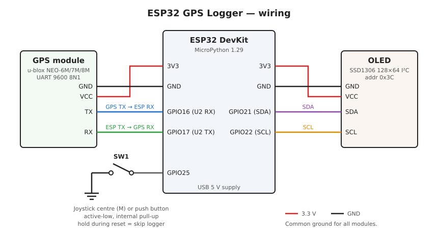

# ESP32 GPS Logger

MicroPython GPS track logger for the ESP32. Away from home it records your
position to GPX files on the internal flash; once it sees the home WiFi it
stops logging and uploads the finished tracks to a
[Dawarich](https://dawarich.app) server via its Overland API endpoint.

## Features

- Reads NMEA (`RMC`, `GGA`, `GSA`, `GSV`) from a u-blox NEO-6M/7M/8M over UART, with checksum validation.
- Samples the position every second and records a point only after moving more than 10 m from the last recorded one, to GPX 1.1 files named `/gpx/YYYYMMDD_HHMMSS.gpx`.
- Power-loss safe: each file is always a complete GPX document, written in batches every 60 s (LittleFS commits on close).
- Short fix losses start a new track segment; a gap over 5 minutes starts a new file.
- Keeps 32 kB of flash free; stops logging when full.
- On WiFi: uploads finished files oldest-first, 50 points per POST, trimming accepted points from the file and deleting it when empty. Resends after a crash are deduplicated by Dawarich.
- 128×64 OLED status screen: WiFi state, GPS fix (2D/3D/DGPS), mode (LOG/UPLOAD), free flash and points left to upload.

## Hardware

| Part | Notes |
|------|-------|
| ESP32 dev board | Original ESP32 (Xtensa, `-march=xtensawin`) |
| GPS module | u-blox NEO-6M / 7M / 8M, UART at 9600 baud |
| OLED display | SSD1306, 128×64, I²C (address 0x3C) |
| Push button | E.g. the centre (M) press of a 5-way joystick module; optional |

### Wiring



| ESP32 pin | Connects to | Function |
|-----------|-------------|----------|
| 3V3 | GPS VCC, OLED VCC | Power |
| GND | GPS GND, OLED GND, button | Common ground |
| GPIO16 | GPS TX | UART2 RX (NMEA in) |
| GPIO17 | GPS RX | UART2 TX |
| GPIO21 | OLED SDA | I²C0 data |
| GPIO22 | OLED SCL | I²C0 clock |
| GPIO25 | Button → GND | Boot bypass (internal pull-up, active low) |

Most GPS and OLED breakout boards already have I²C pull-ups and a regulator;
check yours if powering the GPS from 5 V instead.

## Software setup

Requirements on the host: Linux, Python 3, and the ESP32 flashed with
**MicroPython 1.29** (the `.mpy` version must match).

```bash
python3 -m venv .venv
.venv/bin/pip install mpremote "mpy-cross==1.29.*"

# drivers on the device (skip any already frozen into your firmware)
.venv/bin/mpremote mip install ssd1306
.venv/bin/mpremote mip install requests
```

Create `.env` and copy it to the device root:

```ini
SSID=MyHomeWifi
WPA2=wifi-password
GEO_URL=https://dawarich.example.com
API_KEY=your-dawarich-api-key
```

```bash
.venv/bin/mpremote cp .env :.env
```

Without `.env` the logger still records GPX; it just never goes online.

## Deploy

```bash
./deploy.sh                      # default port /dev/ttyUSB0
PORT=/dev/ttyUSB1 ./deploy.sh
```

The script compiles `gps_logger.py` to `gps_logger.mpy`, copies it with
`main.py`, removes any stray `gps_logger.py` on the device, and resets it.

The module must run precompiled: compiling on the device grows the Python
heap and leaves too little ESP-IDF heap (~40 kB contiguous) for mbedTLS, so
HTTPS uploads fail with `ENOMEM`.

## Usage

- Power on: the logger starts automatically, scans once for the home network, then shows the status screen.
- **Skip the logger**: hold the button (GPIO25) while resetting — `main.py` exits to the REPL so you can use `mpremote`.
- Logs live in `/gpx/` on the device; pull them manually with:

  ```bash
  .venv/bin/mpremote cp :/gpx/20261005_101500.gpx .
  ```

## Configuration

Constants at the top of `gps_logger.py`:

| Constant | Default | Meaning |
|----------|---------|---------|
| `SAMPLE` | 1000 ms | Interval between position samples |
| `MIN_MOVE` | 10 m | Distance from the last recorded point before a new one is recorded |
| `FLUSH` | 60000 ms | Interval between flash writes |
| `NEW_FILE_GAP` | 300 s | Fix loss that starts a new file |
| `MIN_FREE` | 32 kB | Flash reserve |
| `UPLOAD_BATCH` | 50 | Points per POST |
| `UPLOAD_RETRY` | 60000 ms | Back-off after a failed upload |
| `DEVICE_ID` | `esp32` | Device ID sent to Dawarich |
